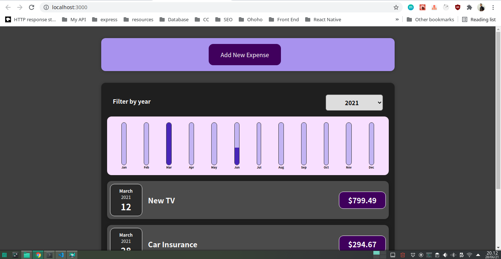

# About Project

React Expenses Tracker is a react app that I create with following course on Udemy.

## How to install

1. Clone this project
2. Go Project Directory

```sh
cd react-expenses-tracker
```

3. Install Dependencies

NPM

```sh
npm install
```

or

Yarn

```sh
yarn install
```

4. Run Project

NPM

```sh
npm start
```

or

Yarn

```sh
yarn start
```

5. Open Browser type this 'localhost:3000' on address bar

## Screenshot


